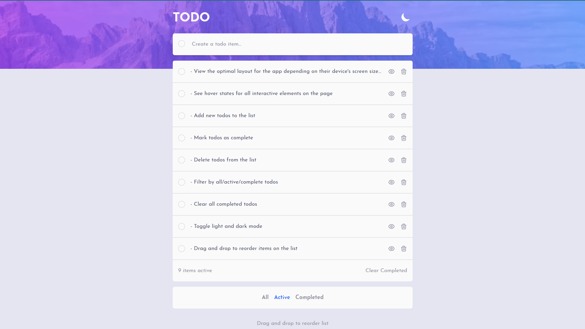
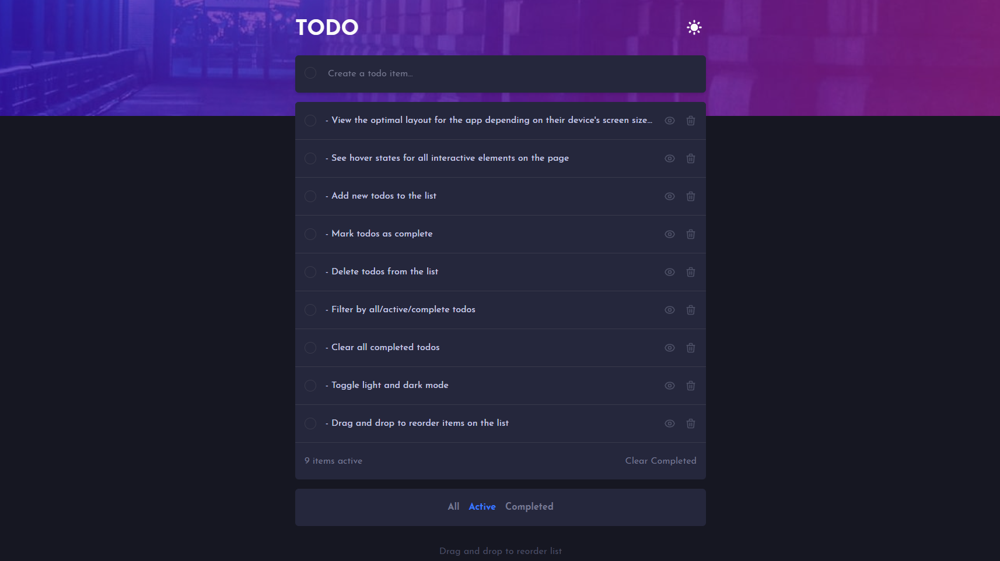

# Frontend Mentor - Todo app solution

This is a solution to the [Todo app challenge on Frontend Mentor](https://www.frontendmentor.io/challenges/todo-app-Su1_KokOW). Frontend Mentor challenges help you improve your coding skills by building realistic projects.

## Table of contents

- [Overview](#overview)
  - [The challenge](#the-challenge)
  - [Screenshot](#screenshot)
  - [Links](#links)
- [My process](#my-process)
  - [Built with](#built-with)
  - [What I learned](#what-i-learned)
  - [Useful resources](#useful-resources)
- [Author](#author)

**Note: Delete this note and update the table of contents based on what sections you keep.**

## Overview

### The challenge

Users should be able to:

- View the optimal layout for the app depending on their device's screen size
- See hover states for all interactive elements on the page
- Add new todos to the list
- Mark todos as complete
- Delete todos from the list
- Filter by all/active/complete todos
- Clear all completed todos
- Toggle light and dark mode
- Drag and drop to reorder items on the list

### Screenshot

### Links

- Solution URL: [https://devddtodoapp.netlify.app](https://devddtodoapp.netlify.app)
- Live Site URL: [https://github.com/AdebayoMarzouq/dragDropTodo](https://github.com/AdebayoMarzouq/dragDropTodo)

## My process

### Built with

- Semantic HTML5 markup
- CSS custom properties
- Flexbox
- CSS Grid
- Mobile-first workflow
- [React](https://reactjs.org/) - JS library
- [Framer Motion](https://www.framer.com/docs/) - React animations library
- [Tailwind CSS](https://tailwindcss.com) - For styles

### What I learned

- Animations using the framer motion library
- React hooks like the useRef and useContext hooks

### Useful resources

- [React Docs](https://reactjs.org/) - This helped me with the hooks and other parts of the react library.
- [Framer Motion Docs](https://www.framer.com/docs/) - Everything you need to implement beautiful animations and the reorder group and items can be found here.

## Author

- Frontend Mentor - [@AdebayoMarzouq](https://www.frontendmentor.io/profile/AdebayoMarzouq)
- Twitter - [@iammarzouq](https://www.twitter.com/iammarzouq)

# Getting Started with Create React App

This project was bootstrapped with [Create React App](https://github.com/facebook/create-react-app).

## Available Scripts

In the project directory, you can run:

### `npm install`

Installed all dependencies needed to run the app locally on your computer.

### `npm start`

Runs the app in the development mode.\
Open [http://localhost:3000](http://localhost:3000) to view it in your browser.

The page will reload when you make changes.\
You may also see any lint errors in the console.

### `npm test`

Launches the test runner in the interactive watch mode.\
See the section about [running tests](https://facebook.github.io/create-react-app/docs/running-tests) for more information.

### `npm run build`

Builds the app for production to the `build` folder.\
It correctly bundles React in production mode and optimizes the build for the best performance.

The build is minified and the filenames include the hashes.\
Your app is ready to be deployed!

See the section about [deployment](https://facebook.github.io/create-react-app/docs/deployment) for more information.
